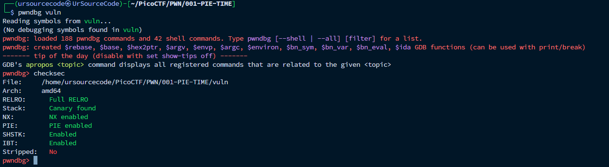
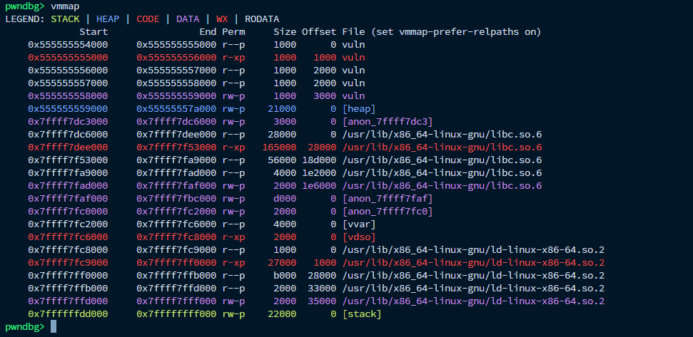
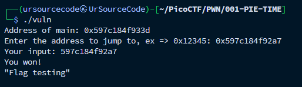
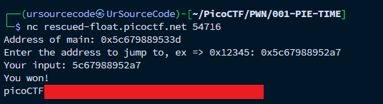

## 🥧 Challenge Overview

**PIE TIME** is a binary exploitation challenge where we take advantage of a program that lets us input any address to jump to. The goal is to redirect execution to the hidden `win()` function, which prints the flag.

We’re given two files:
- `vuln` — the compiled binary
- `vuln.c` — the C source code

The twist? The binary uses PIE (Position Independent Executable), meaning the memory layout is randomized every time the program runs.

---

## 🧩 Reviewing the Code

Here’s the key part of the code:

```c
scanf("%lx", &val);
void (*foo)(void) = (void (*)())val;
foo();
```

This snippet gives us full control over where the program jumps. All we need is the correct address.

---

## 🔍 Exploitation Steps

### 1. Check Binary Protections

Using `checksec`, we confirm that PIE is enabled:



This means the binary’s memory layout changes on each run. Hardcoded addresses won't work.

---

### 2. Get the Offset of `win()`

We use `nm` to find the relative location of `win()`:

```bash
nm vuln | grep ' win'
00000000000012a7 T win
```

The `win()` function is located at offset `0x12a7` from the base.

---

### 3. Calculate the Runtime Address

When we run the binary in `pwndbg` and use `vmmap`, we can find the base address where the binary is loaded:



Assuming the base is `0x555555554000`, the address of `win()` becomes:

```bash
0x555555554000 + 0x12a7 = 0x55555555412a7
```

---

### 4. Jump to `win()`

We enter the calculated address into the program, which then jumps to `win()`:



And just like that, the flag is printed.

---

### 5. Apply It Remotely

On the remote challenge server, the binary prints the address of `main()` when it runs. We can work backwards:

- Subtract the static offset of `main()` to find the base
- Add `0x12a7` to compute the address of `win()`

Entering that value gets us the flag:



---

## 💡 Understanding PIE and Offsets

In PIE-enabled binaries, absolute addresses change, but relative offsets remain constant.

> `win()` is always 0x12a7 bytes after the base address.

As long as we know the current base, we can reliably calculate the address of `win()`.

---

## 🧠 Final Thoughts

This challenge is a solid example of how understanding memory layout and binary behavior can be just as effective as more advanced exploitation techniques. No overflows or gadgets needed—just a calculated jump.

---

## 🔗 Additional Resources

- [PIE TIME | PicoCTF Challenge](https://play.picoctf.org/practice/challenge/490)
